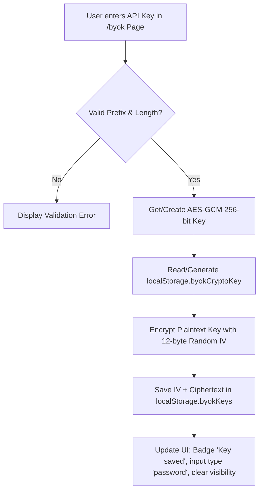
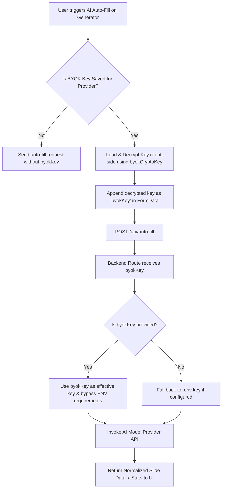

# BYOK (Bring Your Own Key) System Flow Report

Generated: 2026-06-01

## Overview
- **Visura** now supports secure client-side API Key management, allowing users to provide their own **Google Gemini** or **Groq** keys for the AI Auto-Fill feature.
- Keys are validated, encrypted, and stored entirely within the user's browser using the **Web Crypto API (AES-GCM 256-bit)**.
- Encrypted keys are decrypted client-side just-in-time and sent via POST payload (`byokKey`) to the backend, bypassing environment variables (`.env`) and keeping keys private to the user.

---

## Flow Diagram

### 1. Key Storage Flow (Encryption & Save)


### 2. AI Auto-Fill Request Flow (Decryption & API Call)


---

## Frontend Flow

The frontend consists of the new `/byok` settings view and integration inside the prompt generator module.

- **Routing & Views**: 
  - Backend serves `/byok` route mapping to [public/byok.html](file:///c:/xampp/htdocs/faydev/visura/public/byok.html) in [server.js](file:///c:/xampp/htdocs/faydev/visura/server.js#L46-L48).
  - Navigation links in the sidebar are configured in [public/byok.html](file:///c:/xampp/htdocs/faydev/visura/public/byok.html#L48-L50), [public/app.html](file:///c:/xampp/htdocs/faydev/visura/public/app.html), [public/prompts.html](file:///c:/xampp/htdocs/faydev/visura/public/prompts.html), [public/history.html](file:///c:/xampp/htdocs/faydev/visura/public/history.html), and [public/settings.html](file:///c:/xampp/htdocs/faydev/visura/public/settings.html).
- **Initialization (`init` in [public/js/byok.js](file:///c:/xampp/htdocs/faydev/visura/public/js/byok.js#L394-L444))**:
  - Automatically checks `localStorage` for Gemini and Groq payloads via `hasByokKey()`.
  - Updates card styling and status badges dynamically using `updateStatusBadge()`.
  - **Decryption on Load**: If keys are saved, it decrypts them on load using `getDecryptedByokKey()` and populates the password inputs.
- **Key Operations**:
  - **Save Key (`handleSave` in [public/js/byok.js](file:///c:/xampp/htdocs/faydev/visura/public/js/byok.js#L261-L307))**: Validates inputs, encrypts the plaintext key using `encryptText()`, updates the local storage, resets the visibility icon, and displays a glassmorphic toast notification.
  - **Clear Key (`handleClear` in [public/js/byok.js](file:///c:/xampp/htdocs/faydev/visura/public/js/byok.js#L313-L320))**: Removes the provider payload from storage, clears inputs, updates badges, and shows a confirmation toast.
  - **Visibility Toggle (`initVisibilityToggles` in [public/js/byok.js](file:///c:/xampp/htdocs/faydev/visura/public/js/byok.js#L326-L339))**: Toggles inputs between `password` and `text` with matching eye icons.
  - **Live Validation & Blur Checks**: Validates prefixes (`AIza` or `gsk_`) and lengths inline to prevent obviously invalid key saves.

---

## DOM to JS Mapping (`public/byok.html` & `public/js/byok.js`)

| DOM ID | Component / Description | HTML Reference | JS Event / Handling |
| --- | --- | --- | --- |
| `tab-byok` | Sidebar menu link for API Keys | [public/byok.html:L48](file:///c:/xampp/htdocs/faydev/visura/public/byok.html#L48) | Direct navigation link, active state highlight |
| `byok-info-banner` | Informational dismissible banner | [public/byok.html:L91](file:///c:/xampp/htdocs/faydev/visura/public/byok.html#L91) | Managed by `initInfoBanner()`, dismiss state cached |
| `byok-card-gemini` | Gemini Card container | [public/byok.html:L105](file:///c:/xampp/htdocs/faydev/visura/public/byok.html#L105) | Border styled differently when key is saved |
| `byok-status-gemini` | Gemini Status badge | [public/byok.html:L116](file:///c:/xampp/htdocs/faydev/visura/public/byok.html#L116) | Dot & label toggled by `updateStatusBadge()` |
| `byok-input-gemini` | Gemini password input field | [public/byok.html:L129](file:///c:/xampp/htdocs/faydev/visura/public/byok.html#L129) | Bound to `handleSave()`, blur/focus listeners, populated on load |
| `byok-save-gemini` | Gemini Save Button | [public/byok.html:L148](file:///c:/xampp/htdocs/faydev/visura/public/byok.html#L148) | Click triggers `handleSave()`, displays spinner state |
| `byok-clear-gemini` | Gemini Clear Button | [public/byok.html:L151](file:///c:/xampp/htdocs/faydev/visura/public/byok.html#L151) | Click triggers `handleClear()`, hidden when key not set |
| `byok-card-groq` | Groq Card container | [public/byok.html:L158](file:///c:/xampp/htdocs/faydev/visura/public/byok.html#L158) | Border styled differently when key is saved |
| `byok-status-groq` | Groq Status badge | [public/byok.html:L169](file:///c:/xampp/htdocs/faydev/visura/public/byok.html#L169) | Dot & label toggled by `updateStatusBadge()` |
| `byok-input-groq` | Groq password input field | [public/byok.html:L182](file:///c:/xampp/htdocs/faydev/visura/public/byok.html#L182) | Bound to `handleSave()`, blur/focus listeners, populated on load |
| `byok-save-groq` | Groq Save Button | [public/byok.html:L201](file:///c:/xampp/htdocs/faydev/visura/public/byok.html#L201) | Click triggers `handleSave()`, displays spinner state |
| `byok-clear-groq` | Groq Clear Button | [public/byok.html:L204](file:///c:/xampp/htdocs/faydev/visura/public/byok.html#L204) | Click triggers `handleClear()`, hidden when key not set |
| `app-toast` | Glassmorphic Toast banner | [public/byok.html:L223](file:///c:/xampp/htdocs/faydev/visura/public/byok.html#L223) | Triggered via `showToast()` helper |

---

## Security & Crypto Design

The encryption system is implemented pure-client-side inside [public/js/byok.js](file:///c:/xampp/htdocs/faydev/visura/public/js/byok.js) using the browser's native **Web Crypto API**:

- **Algorithm**: **AES-GCM (Galois/Counter Mode)** with a **256-bit key length**. AES-GCM provides both confidentiality and integrity verification (authenticated encryption).
- **Persistent Key**: A random 256-bit key is generated upon first setup and stored as a base64 string in `localStorage.byokCryptoKey`.
- **Initialization Vector (IV)**: A cryptographically strong pseudo-random 12-byte IV is generated using `crypto.getRandomValues()` for **every individual encryption call**. This ensures that even identical API keys produce unique and completely distinct ciphertexts on each save.
- **Payload Schema**: Encrypted outputs are encoded in base64 and structured in `localStorage.byokKeys` as:
  ```json
  {
    "gemini": {
      "iv": "base64String...",
      "ct": "base64String..."
    },
    "groq": {
      "iv": "base64String...",
      "ct": "base64String..."
    }
  }
  ```

---

## Backend Integration Flow

When running AI Auto-Fill, the frontend pulls the stored key and passes it down.

- **Auto-Fill Script Integration ([public/js/autoFill.js](file:///c:/xampp/htdocs/faydev/visura/public/js/autoFill.js))**:
  - In `runAutoFill()`, it resolves the model's provider (`gemini` or `groq`).
  - Checks if a key is configured via `hasByokKey(provider)`.
  - Resolves the plaintext key: `await getDecryptedByokKey(provider)` and appends it to `FormData` under the name `byokKey` in [public/js/autoFill.js:L215](file:///c:/xampp/htdocs/faydev/visura/public/js/autoFill.js#L215).
- **Backend Route Handler ([server/routes/autoFill.js](file:///c:/xampp/htdocs/faydev/visura/server/routes/autoFill.js))**:
  - Pulls `byokKey` from `req.body.byokKey`.
  - Forwards the key to the AI extraction helper: `autoFillFromSources({ brief, docText }, modelId, byokKey)`.
- **Service Integration ([server/ai/autoFillService.js](file:///c:/xampp/htdocs/faydev/visura/server/ai/autoFillService.js))**:
  - `getModelOrThrow(modelId, byokKey)`: If a `byokKey` is supplied, backend skips validating the presence of environment keys (`GEMINI_API_KEY` or `GROQ_API_KEY`), allowing the request to proceed seamlessly.
  - `autoFillFromSources(...)`: Resolves the active key to use:
    ```javascript
    const envKey = model.provider === 'gemini' ? GEMINI_KEY : GROQ_KEY;
    const effectiveKey = byokKey || envKey;
    ```
    This prioritizes the custom BYOK key, falling back to the environment variable configuration.
  - The effective key is forwarded to `callGemini` or `callGroq` to construct the SDK / Fetch request payload.

---

## Error Handling & Key Validation

- **Prefix Guards**: The system enforces expected key patterns before saving:
  - Gemini: Must start with `AIza`
  - Groq: Must start with `gsk_`
  - Minimum length: `10` characters
- **Backend Absence Guard**: If neither `byokKey` nor `.env` variables are configured for the target provider, the system returns a descriptive error:
  `No API key available for [provider]. Configure it in Settings → API Keys or set the ENV variable.`
- **Decryption Auth Tag verification**: AES-GCM validates the authentication tag on decryption. If a key is corrupted or `byokCryptoKey` is altered, `decryptText()` throws an exception, and the UI gracefully resets.

---

## Data Contracts

### Request Payload (`POST /api/auto-fill`)
- Form data:
  - `brief`: string (optional)
  - `docFile`: file (optional)
  - `model`: string (required, e.g., `'gemini-2.5-flash'`)
  - `byokKey`: string (optional, decrypted Gemini or Groq key)

---

## Test Coverage

Two dedicated unit test suites have been introduced to verify all parts of the BYOK system flow:

1. **Crypto Verification Suite ([tests/byokCrypto.test.js](file:///c:/xampp/htdocs/faydev/visura/tests/byokCrypto.test.js))**:
   - `testPrefixValidation`: Validates correct prefix matching (`AIza`, `gsk_`), length assertions, and invalid formats.
   - `testEncryptDecryptRoundtrip`: Validates that plaintext is accurately encrypted, and can be decrypted back to its exact form.
   - `testRandomIvUniquePerCall`: Ensures unique ciphertexts are produced for the same input using unique initialization vectors.
   - `testDecryptWithWrongKeyThrows`: Validates that decrypting with an incorrect key fails securely with an authentication error.
   - `testEncryptDecryptUnicode`: Checks that unicode and special character ranges are preserved.

2. **Integration Fallback Suite ([tests/byokAutoFillFallback.test.js](file:///c:/xampp/htdocs/faydev/visura/tests/byokAutoFillFallback.test.js))**:
   - `testByokOverridesEnvKey`: Verifies that providing a `byokKey` bypasses backend environment requirements.
   - `testFallbackToEnvKeyWhenNoByok`: Verifies fallback to environment variables when `byokKey` is not provided.
   - `testThrowsWhenNoByokAndNoEnvKey`: Verifies that helpful descriptive exceptions are thrown when no keys exist.
   - `testIsProviderAvailableWithByok`: Confirms providers are declared "available" client-side if a BYOK key is configured, regardless of env keys.
